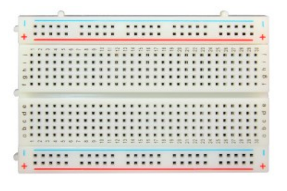
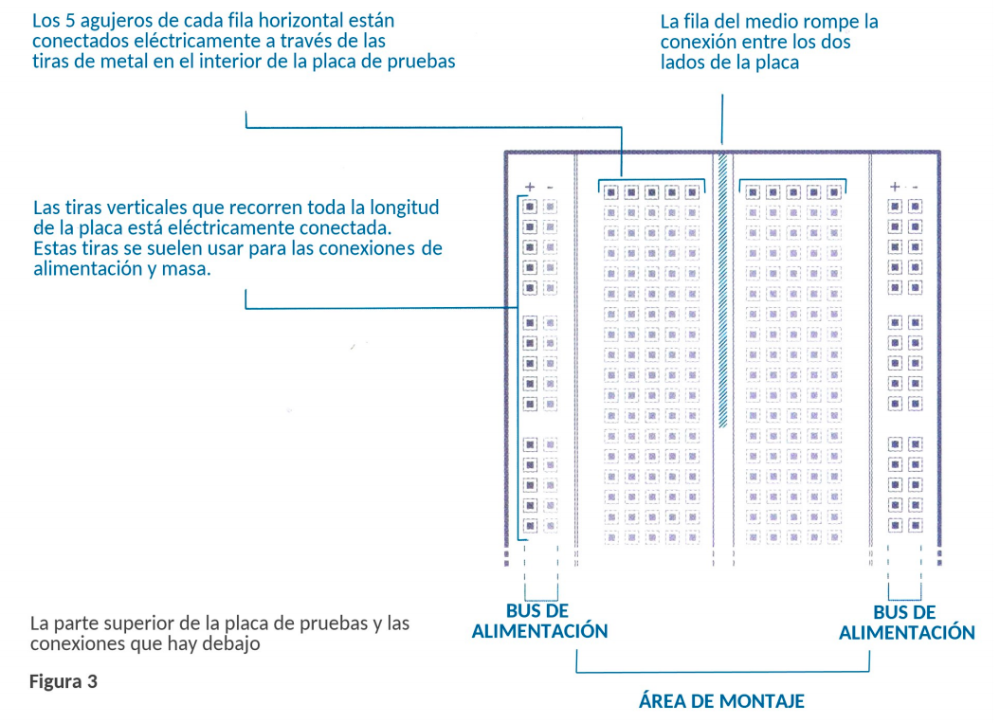
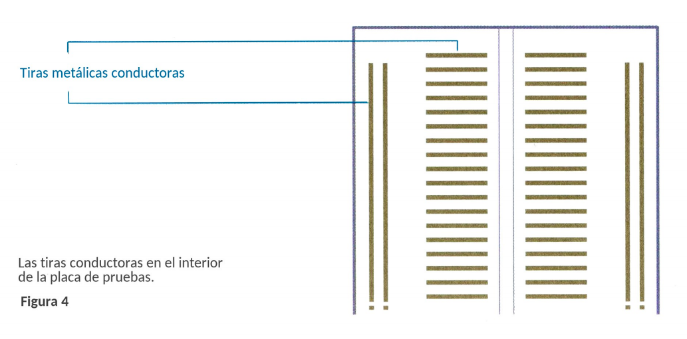
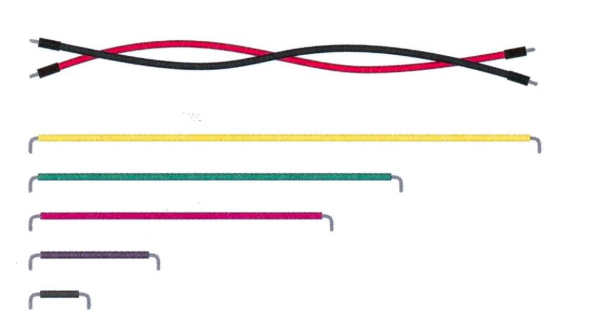
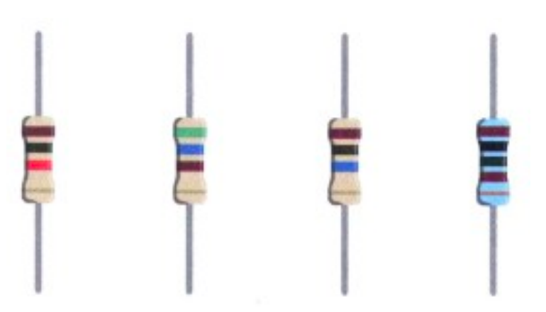
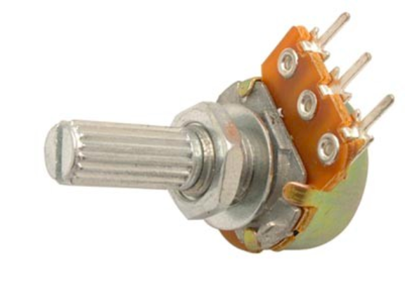
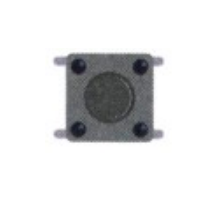
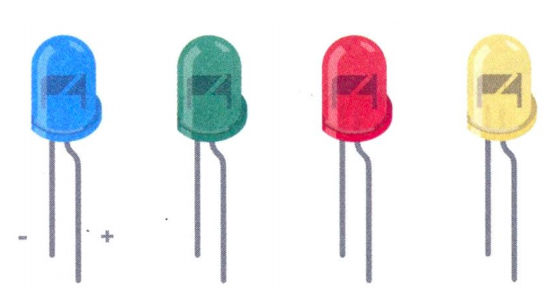

# Circuitos

## Conceptos Básicos

### Electricidad

### Voltaje

### Intensidad de corriented

### DC y AC

### Resistencia Eléctrica

### Ley de Ohm

### Potencia eléctrica

### Señales digitales y señales analógicas

## Componentes eléctricos básicos

### Protoboard

### Cables puente

### Resistores

### Potenciómetros

### Push-button

### Diodos (LEDs)

