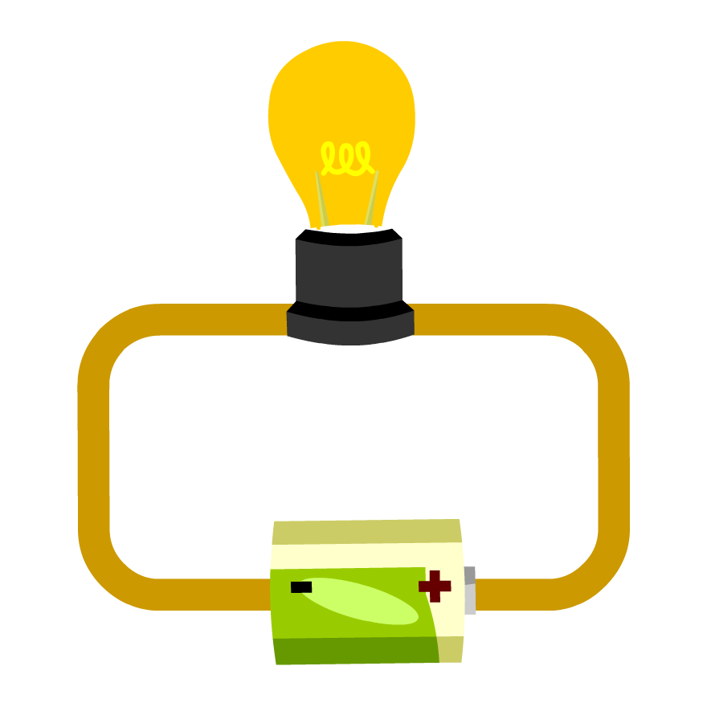
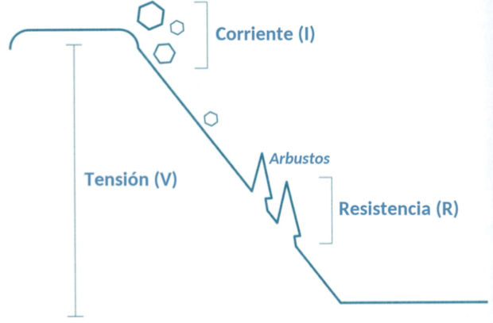
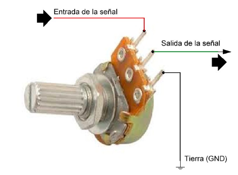

# Circuitos

## Conceptos Básicos

### Electricidad

Los electrones son cargas subatómicas que poseen cargas eléctricas negativas. Físicamente, las cargas eléctricas de sentido opuesto son atraídas entre sí, por este motivo los electrones son atraídos a una carga positiva equivalente.

Cuando en un extremo(también llamado "polo") de un material conductor (alambre) aparece un exceso de electrones y en el otro polo aparece una carencia de estos, los electrones comenzarán a desplazarse de un polo a otro. A esta circulación de electrones por un material conductor se le llama "electricidad".

### Voltaje

También llamado "tensión eléctrica", "diferencia de potencial" o "tensión".
Si entre dos puntos no existe una diferencia de cargas eléctricas, el voltaje entre ambos puntos es de cero. Si entre dos puntos aparece un desequilibrio de cargas, aparecerá un voltaje entre ambos puntos. Este voltaje será mayor a medida que la diferencia de cargas también sea mayor. Es importante notar que el voltaje siempre se mide entre dos puntos. Este es el responsable de la generación de un flujo de electrones. La unidad de el voltaje es el Volt [V]. En el análisis de circuitos se considera que la corriente circula de un polo positivo(potencial mayor) a uno negativo(potencial menor).

### Intensidad de corriente

La intensidad de corriente es una medida eléctrica que define la cantidad de carga eléctrica que pasa a travez de un punto concreto en un determinado tiempo. Es similar en cierto sentido al caudal de agua que circula una tubería. Las unidad de la corriente es el Ampere [A].

### DC y AC

Existen dos tipos fundamentales de circuitos, los circuitos de corriente continua (DC - Direct Current) y los circuitos de corriente alterna (AC - Alternating Current).
La corriente continua es aquella en la que los electrones circulan a través del conductor siempre en la misma dirección.  La corriente alterna es aquella en la que la magnitud y la polaridad del voltaje (y por lo tanto, la de las intensidades también) varían cíclicamente. En la corriente alterna la dirección en la que circulan los electrones varía.
En los circuitos que se van a realizar en este curso,  se va a utilizar en su totalidad la corriente continua.

### Resistencia Eléctrica

La resistencia eléctrica es una propiedad de los objetos, esta es la capacidad para oponerse al paso de la corriente eléctrica a través de él. Cuanto mayor sea la resistencia, más dificultad tendrán los electrones para atravesarlo. La unidad de medida de la resistencia es el Ohm [Ω].

### Analogía

Podemos imaginar un acantilado con una pendiente por donde se deslizan unas rocas cuesta a bajo. Cuanto mayor sea la altura del acantilado, mayor energía tendrán las rocas para llegar hasta la parte inferior. La altura representa el voltaje de un circuito. El número de rocas que caen representa la corriente eléctrica. Las rocas al desplazarse por la pendiente del acantilado, chocan con los arbustos y árboles que se encuentran en este. Haciendo que estas disminuyan su velocidad. La cantidad de arbustos y árboles representa la resistencia en un circuito. Ofreciendo oposición al paso de la electricidad.

### Potencia eléctrica

La potencia de un componente eléctrico/electrónico es la energía consumida por este en un segundo. En el caso de las fuentes de alimentación, la potencia es la energía aportada por esta en un segundo. La unidad de la potencia es el Watt [W].

### Señales digitales y señales analógicas

Las señales eléctricas se pueden clasificar de varias maneras, una forma es clasificarlas en señales digitales y señales analógicas. Una señal digital es aquella que solo tiene un número finito de valores posibles(valores discretos). Por ejemplo, si consideramos como señal el color emitido por un semáforo, este es de tipo digital puesto que solo puede tener tres valores concretos: rojo, amarillo y verde.
Un caso particular de la señal digital es la binaria, donde el número de posibles valores es 2. En la electrónica es muy común trabajar con voltajes o intensidades que tengan este comportamiento (ALTO y BAJO).
Las señales analógicas son aquellas que tienen infinitos valores posibles dentro de un rango determinado. La mayoría de las magnitudes físicas(temperatura, sonido, luz,...) son analógicas.

## Componentes eléctricos básicos

### Protoboard

Es una placa sobre la cual se pueden montar los componentes electrónicos. Facilitando de esta forma la realización de circuitos sin la necesidad de soldar.
En las siguientes imágenes se podrá ver como se componen estas placas. Las filas verticales y horizontales de la placa conducen la electricidad a través de los conectores de metal fino que hay debajo del plástico con agujeros.

### Cables puente

Se utilizan para conectar unos componentes con otros sobre la placa de pruebas(protoboard), y la tarjeta Arduino.

### Resistores

Los resistores son componentes que se oponen al paso de la energía eléctrica. Particularmente, estos se encargan de transformar la energía eléctrica en calor. Estos no tienen polaridad, por lo que es indiferente la posición en que se colocan.
La resistencia de cada resistor va a determinar cuanta oposición va a haber al paso de la corriente. Los valores de las resistencias se indican mediante bandas de colores. Cada color se corresponde con un número, como se puede ver en la tabla inferior. 
Cada
resistencia tiene entre 4 o 5 bandas. En las resistencias con 4 bandas, las dos primeras
bandas indican los dos primeros dígitos del valor de la resistencia, mientras que la tercera
banda de color indica el número de ceros que sigue a los dos primeros valores
(técnicamente esta tercera banda representa potencias de diez). La última banda
especifica la tolerancia: en el ejemplo inferior, se puede leer un valor de resistencia de
10K, y este valor puede variar en más o menos un 5% según esta tolerancia.

### Potenciómetros

Los potenciómetros son resistores con una resistencia variable y que cuenta con tres terminales. En las terminales extremas se conecta la señal de entrada y la tierra, la terminal central se puede usar como una salida de señal.

### Push-button

Son interruptores momentáneos que únicamente permiten el paso de la corriente cuando son presionados. Son buenos para abrir o cerrar el paso a una señal.

### LEDs

Son componentes que convierten la energía eléctrica en energía luminosa. Estos tienen polaridad, esto quiere decir que solo circula corriente a través de ellos en una sola dirección. La terminal más larga es el ánodo y esta se conectara a la alimentación (+), la terminal más corta es el cátodo y esta se conectara a la masa o GND (-).
