# Introducción

Arduino es la mejor forma de introducirse a la programación de microcontroladores y a la computación física.
La computación física es un acercamiento al diseño de la interacción computadora - humano que empieza considerando como los humanos se expresan de forma física.
Las interfaces comunes para la interacción con las que cuentan las computadoras se limitan a un monitor, un teclado, un mouse, entre otros elementos. Con la computación física se toma como referencia el cuerpo humano y sus capacidades para rediseñar esas interfaces. Creando nuevas que puedan responder a lo que los humanos pueden hacer físicamente. Esta está basada en el uso de microcontroladores para procesar estas interacciones.
En la actualidad los microcontroladores se encuentran en muchos de los dispositivos con los que interactuamos diariamente, ya sea un ascensor, un microondas, una computadora, etc.
Los microcontroladores son circuitos integrados programables , capaces de ejecutar órdenes grabadas en su memoria.

## Qué es Arduino?
Arduino es una plataforma de electrónica abierta para la creación de prototipos basada en software y hardware libre, flexibles y fáciles de usar. Se creó para artistas,  estudiantes, diseñadores, aficionados y cualquier interesado en crear entornos u objetos interactivos. 

Arduino está conformado por tres cosas:
* Una placa hardware libre
    *  Esta incorpora un microcontrolador reprogramable y una serie de pines para realizar conexiones.
* Un software gratuito, libre y multiplataforma
    * Es un entorno de desarrollo disponible en Linux, MacOS y Windows. Nos va a brindar muchas facilidades en lo que respecta a la programación de el microcontrolador.
* Un lenguaje de programación libre
    * El lenguaje de programación de Arduino está basado en C/C++.

Se ha mencionado que Arduino está conformado por una placa y un entorno de desarrollo de *hardware y software libre* correspondientemente.

Se llama hardware libre a los dispositivos de hardware cuyas especificaciones y diagramas esquemáticos son de acceso público, ya sea bajo algún tipo de pago o de forma gratuita.

Se le llama software a todo software que respeta la libertad de los usuarios sobre su producto adquirido y, por tanto, una vez obtenido puede ser usado, copiado, estudiado, modificado, y redistribuido libremente.

## Qué podemos hacer con Arduino?
Con Arduino se pueden realizar multitud de proyectos de rango muy variado: desde robótica hasta domótica, pasando por monitorización de sensores ambientales, sistemas de navegación, telemática, etc.

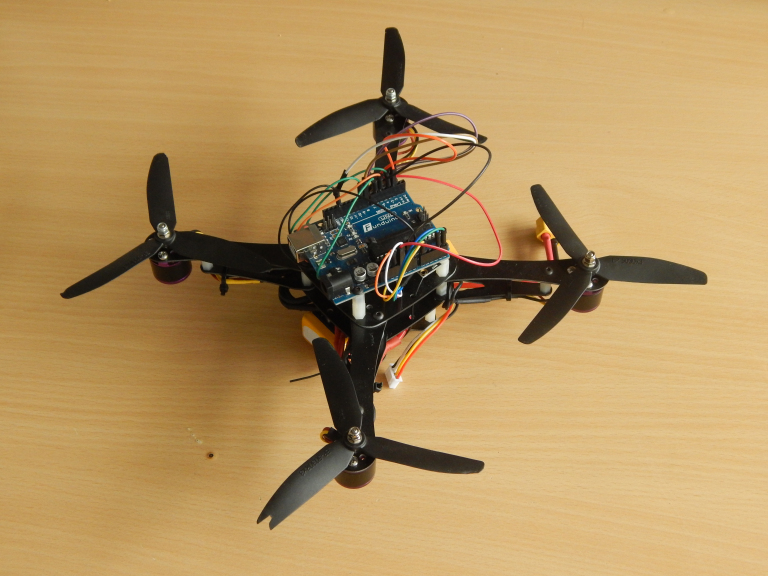
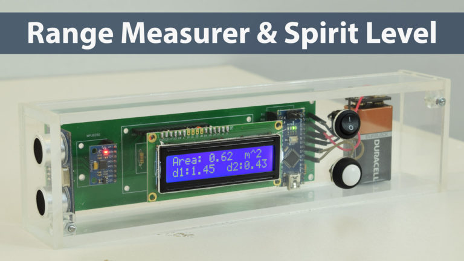
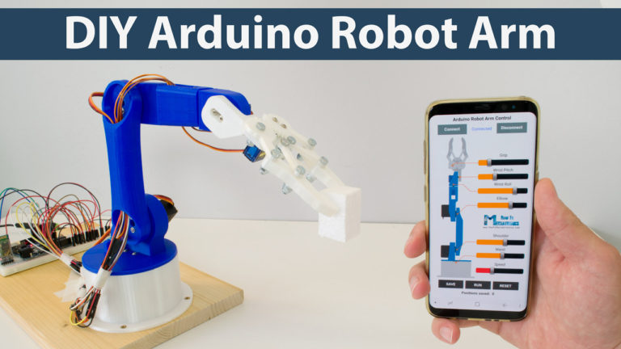
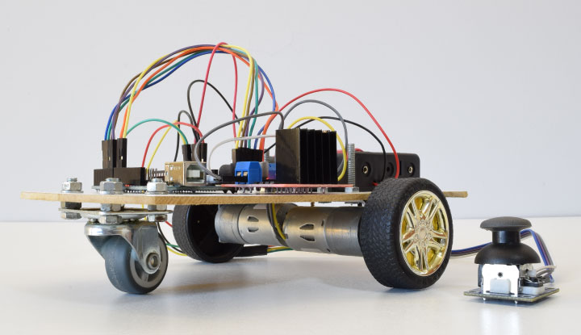
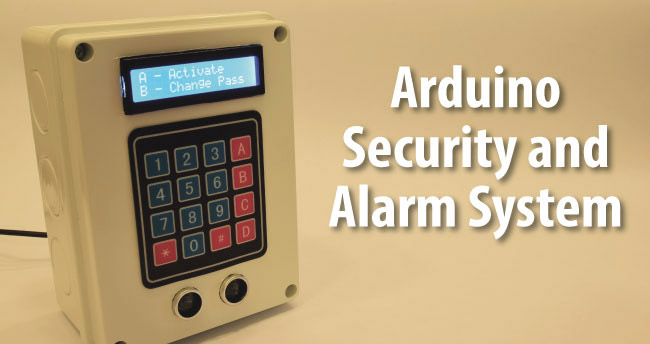
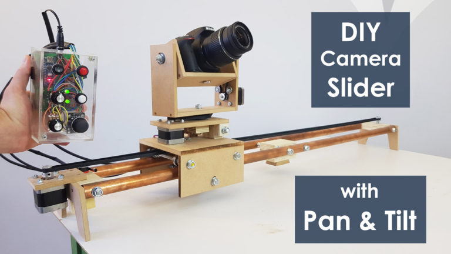

Video:
[Ejemplos de proyectos](https://www.youtube.com/watch?v=0XTcJ5-0u00)

## Historia de Arduino
Arduino nació en el año 2005 en el Instituto de Diseño Interactivo de Ivrea
(Italia). Arduino apareció por la necesidad de contar con un dispositivo para utilizar
en las aulas que fuera de bajo coste, que funcionase bajo cualquier sistema operativo
y que contase con documentación adaptada a gente que quisiera empezar de cero.
La idea original fue, pues, fabricar la placa para uso interno de la escuela. No obstante, el Instituto se vio obligado a cerrar sus puertas precisamente en
2005. Ante la perspectiva de perder en el olvido todo el desarrollo del proyecto
Arduino que se había ido llevando a cabo durante aquel tiempo, se decidió liberarlo y
abrirlo a “la comunidad” para que todo el mundo tuviera la posibilidad de participar
en la evolución del proyecto, proponer mejoras y sugerencias y mantenerlo “vivo”. Y
así ha sido: la colaboración de muchísima gente ha hecho que Arduino poco a poco
haya llegado a ser lo que es actualmente: un proyecto de hardware y software libre
de ámbito mundial. 
## La placa Arduino
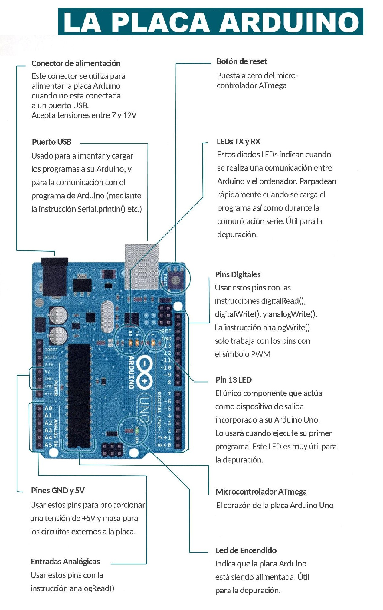
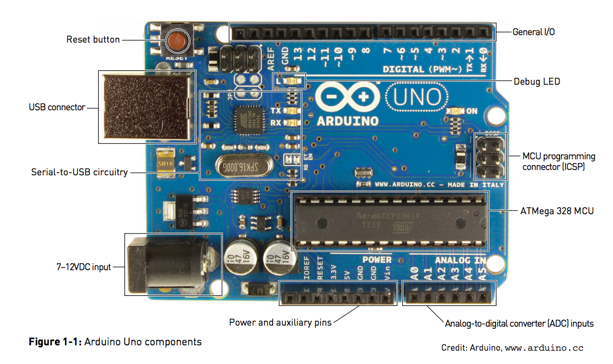

### Microcontrolador
En el corazón de cada placa Arduino se encuentra un microcontrolador Atmel. En el caso particular del Arduino UNO, es un ATmega328.

Los microcontroladores cuentan con tres tipos de memorias.

* Memoria Flash
* Memoria SRAM
* Memoria EEPROM

La memoria flash es la memoria persistente donde se almacena de forma permanente el programa que ejecuta el microcontrolador.

La memoria SRAM es la memoria volátil donde se almacenan los datos en un instante determinado del programa. Estos datos suelen tener un contenido variable a lo largo del tiempo de ejecución.

La memoria EEPROM es memoria persistente donde se almacenan los datos que se desean que permanezcan una vez apagado o reiniciado el microcontrolador.

### Alimentación
Con respecto a la fuente de alimentación del arduino del Arduino, existen diferentes métodos. Se cuenta con un zócalo donde se puede enchufar una clavija de tipo "jack". También se puede conectar los bornes de una pila a los pines "Vin" y "Gnd" (positivo y negativo respectivamente). En ambos casos, la alimentación debe ser menor a los 12 volts, esto dependiendo de la placa Arduino en particular.
De igual forma, la placa cuenta con un conector USB de tipo B que puede servir como fuente de alimentación, aunque su uso principal es para la transferencia de datos.

### 5V
Este pin se puede aporta 5 volts regulados con una intensidad de corriente máxima de 40mA.

### 3,3V
En este pin ofrece un voltaje de 3,3 volts y una intensidad de corriente máxima de 50mA.

### Vin
Este pin puede ser usado para alimentar la placa desde una fuente de alimentación (por ejemplo, una pila de 9V).

### GND
Los pines con la etiqueta GND están conectados a una tierra común. Es importante que todos nuestros circuitos estén conectados a una tierra común como referencia.

### Pin RESET
Si el voltaje en este pin se establece en valor BAJO, el microcontrolador se reiniciará.

### Entradas y salidas digitales
Son los pines del 0 al 13, a estos también se les conoce como pines GPIO ("General Purpose Input/Output"). Estos pines funcionan a 5V y pueden proveer o recibir 40mA.

### Entradas analógicas
Son los pines etiquetados con una A seguidos de un número (A0, A1, A2, ...). Pueden recibir voltajes dentro de un rango continuo entre 0 y 5V.

### Salidas analógicas (PWM)
En la placa se cuentan con pines de salida digital que pueden "simular" un comportamiento analógico. Estos son los que tienen una etiqueta "PWM" (Pulse Width Modulation)

### RX y TX
Permiten que el microcontrolador pueda recibir directamente datos en serie (por el pin RX) o transmitirlos (por el pin TX). Los datos disponibles en el USB también lo estarán en estos pines.

### Pin 13
Este pin está conectado a un LED incrustado en la placa de forma que si el valor recibido en este pin es ALTO (HIGH), el LED se encenderá, si es BAJO (LOW), el LED se apagará.

### Reloj
Este marca el ritmo de ejecución de las instrucciones en el microcontrolador, el ritmo de la lectura y escritura de los datos en memoria, el ritmo de adquisición de datos en los pines de entrada, el ritmo de envío de datos hacia los pines de salida y en general controla la frecuencia de trabajo del microcontrolador.

### Botón reset
Al ser reiniciado manda un voltaje con valor BAJO al pin RESET lo que provoca que el microcontrolador se reinicie.

## Familia Arduino
Existen distintas variantes de la placa Arduino, cada una especializada en trabajar dentro de circunstancias específicas. Además de las placas Arduino, también existen los denominados "shields". Un shield es una placa de circuito impreso que se colocaen la parte superior de una placa Arduino y se conecta a ella mediante un acoplamiento de pines. Su función es ampliar y complementar las funcionalidades de la placa Arduino base.
Una lista completa de las diferentes placas y shields disponibles junto con sus especificaciones se puede encontrar en [esta página](https://www.arduino.cc/en/Main/Products).

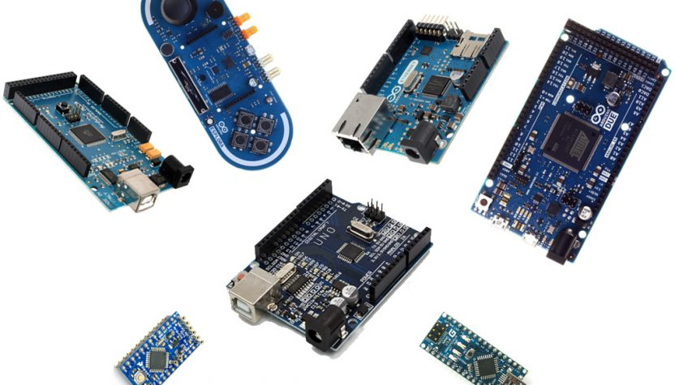

### Placas

#### Arduino UNO

Es el modelo de referencia de la plataforma Arduino y es el más usado y documentado de las plácas disponibles.
Cuenta con 14 pines de entrada/salida digitales y 6 entradas analógicas.
#### Arduino Mega 2560
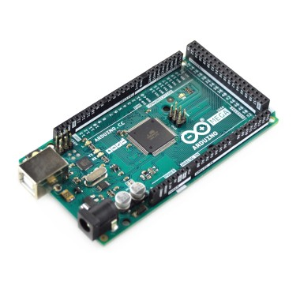

Como características más
destacables diremos que tiene 54 pines de entrada/salida digitales, 16 entradas analógicas y 4
receptores/transmisores serie TTL-UART.
#### Arduino Mega ADK
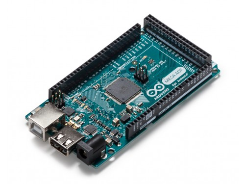

La placa ADK se puede conectar cualquier dispositivo que tenga un
puerto USB periférico (teléfonos móviles, cámaras de fotos o vídeo, teclados,
ratones, joysticks y mandos de diferentes videoconsolas, etc.)
En concreto, la placa Arduino ADK está especialmente diseñada para
interactuar con teléfonos móviles funcionando con el sistema Android. 
#### Arduino Ethernet
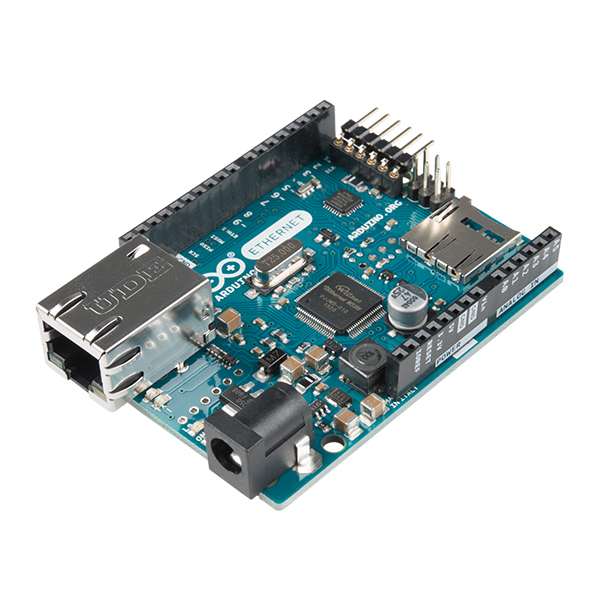

La placa Arduino Ethernet permite transferir datos entre ella misma
(los cuales pueden ser obtenidos de algún sensor, por ejemplo) y cualquier otro
dispositivo conectado a su misma red LAN
#### Arduino Lilypad
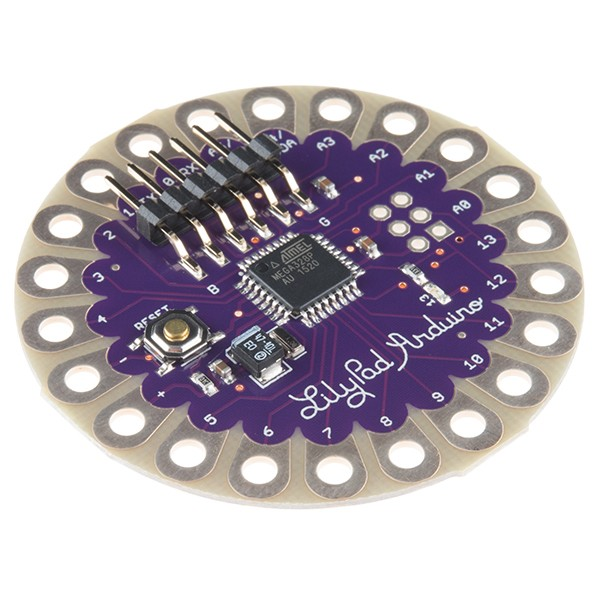

La placa Arduino LilyPad está diseñada para ser cosida a material textil.
Permite además conectarle (mediante hilos conductores) fuentes de alimentación,
sensores y actuadores de forma que se puedan “llevar encima”, haciendo posible la
creación de vestidos y ropa “inteligente”. 
#### Arduino Nano

La característica más destacable de esta placa es que a pesar de su tamaño
(0,73 pulgadas de anchura por 1,70 de longitud), sigue ofreciendo el mismo número de salidas y entradas digitales y analógicas que la Arduino UNO y la misma
funcionalidad que esta.

### Shields

#### Arduino Ethernet Shield
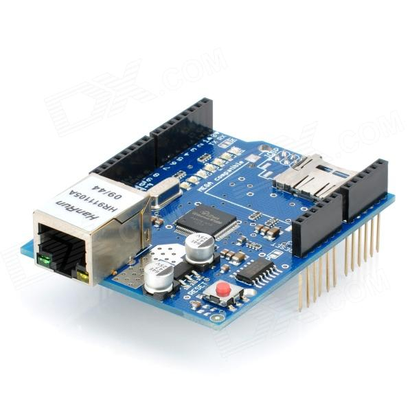

Aporta la misma
funcionalidad que la placa Arduino Ethernet pero en forma de shield
complementario acoplado a la placa Arduino UNO.
#### Arduino WiFi Shield
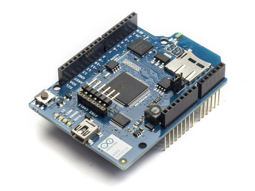

Este shield está pensado para los que le quieren añadir a la placa Arduino
UNO la capacidad de conectarse inalámbricamente a una red TCP/IP. Las redes a las que se puede conectar pueden ser abiertas, o bien estar
protegidas mediante encriptación de tipo WEP o WPA2-Personal.
#### Arduino Proto Shield
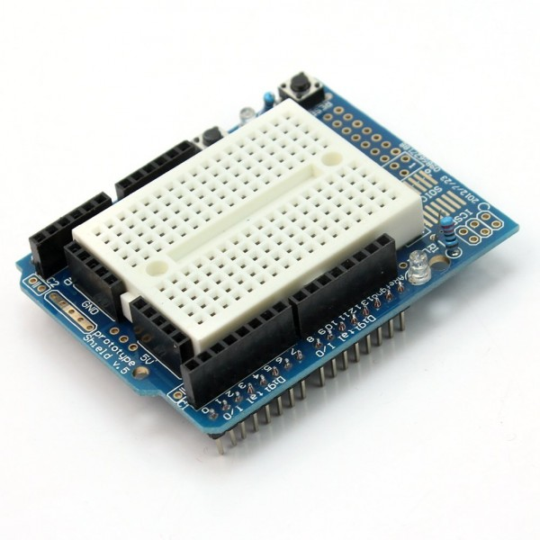

Básicamente lo que hace es ofrecer un área de trabajo donde se pueden colocar los diferentes componentes electrónicos que necesitemos para montar nuestro proyecto.
#### Arduino Motor Shield

El shield Arduino Motor nos permite
dominar la velocidad y sentido de giro de hasta dos motores DC de forma
independiente o bien estas dos magnitudes de un motor paso a paso. 

## Software Arduino

La IDE de Arduino se puede descargar desde [esta página](https://www.arduino.cc/en/Main/Software). Una vez descargado, al abrir la IDE se desplegara una ventana como la siguiente:
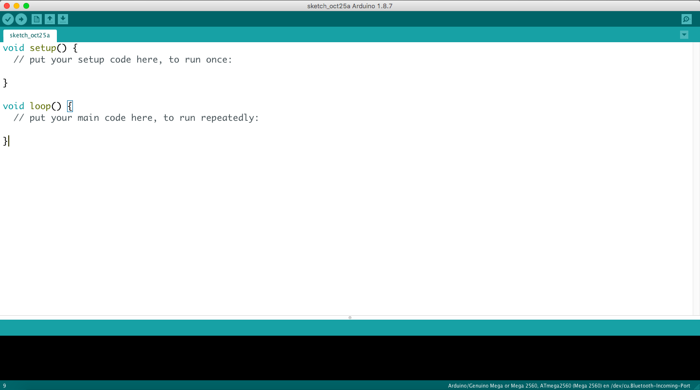
Las principales zonas que la conforman se pueden apreciar en la siguiente imágen.
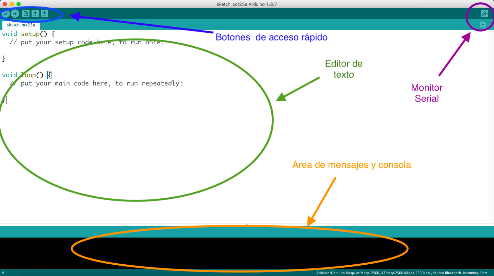
La zona de editor de texto es la que más vamos a ocupar puesto que en ella se van a realizar los programas o scripts que van a ser ejecutados por la placa Arduino.
El Area de mensajes y consola nos brinda información reelevante sobre el proceso de copilación y posibles errores que se presenten en la comunicación entre la placa y la computadora. De igual forma, aquí se van a mostrar los diferentes errores que se presenten en el programa al momento de su compilación.
Los botones de acceso rápido nos van a permitir realizar acciones de forma sencilla, como lo es compilar el programa, abrir un programa y cargar un programa a la placa Arduino.